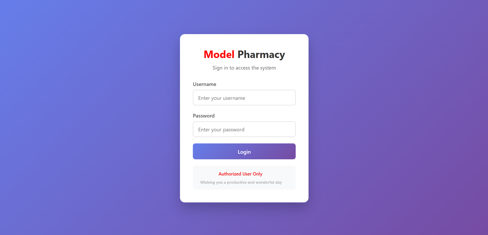
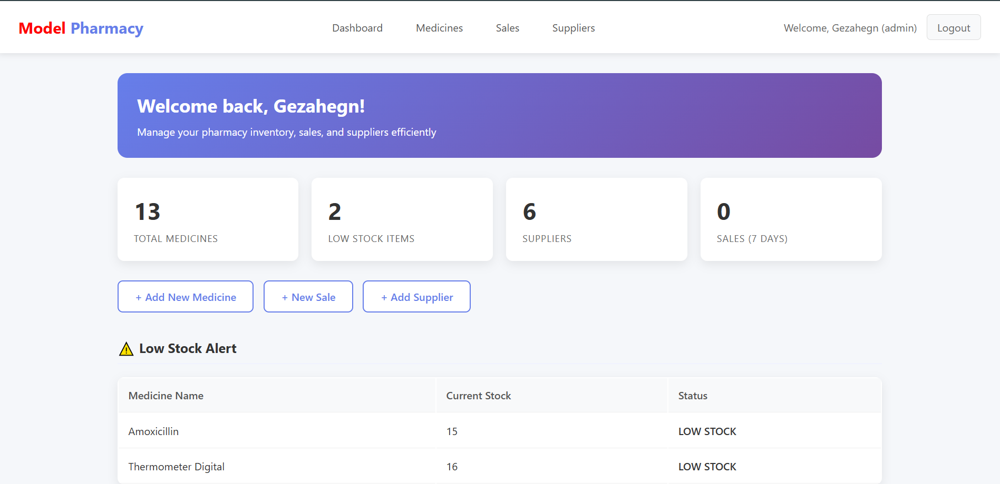
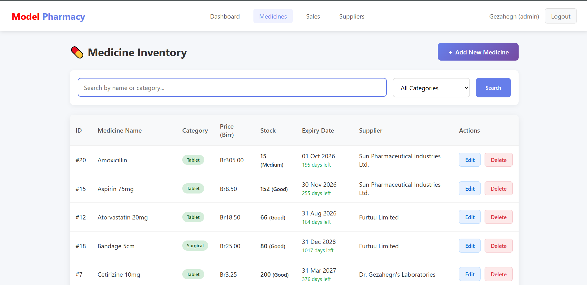
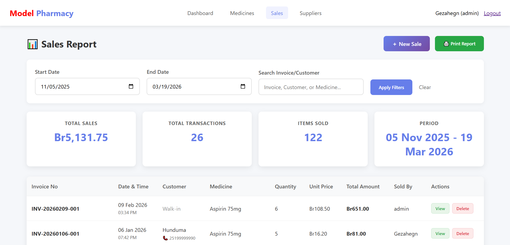
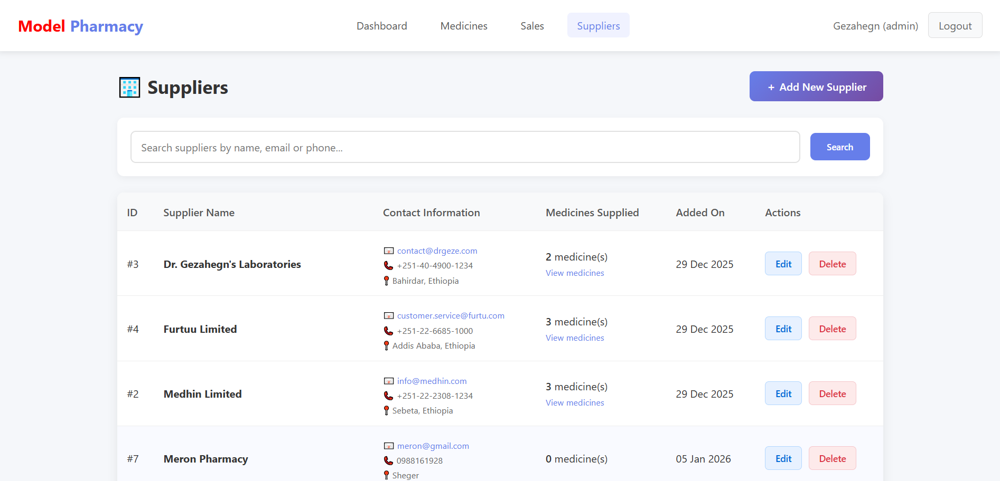
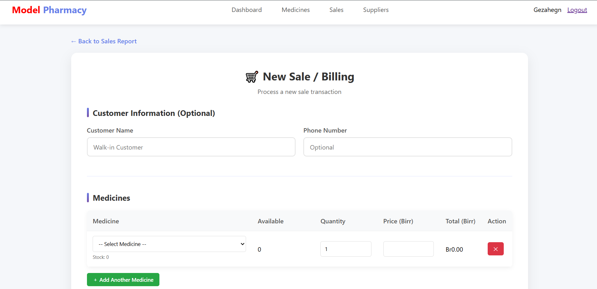

Pharmacy Management System
h
h
h
h
h

A comprehensive web-based Pharmacy Management System built with PHP and MySQL. This system streamlines pharmacy operations including inventory management, sales processing, supplier tracking, and reporting.

📋 Table of Contents

📌 Overview

✨ Features

🛠 Technologies Used

💻 System Requirements

🚀 Installation Guide

🗄 Database Setup

📖 Usage

📸 Screenshots

📁 Folder Structure

🔒 Security Features

🚧 Future Enhancements

🤝 Contributing

📞 Contact

📌 **Overview**
The Pharmacy Management System is designed to replace manual record-keeping with an automated digital solution. It helps pharmacists and administrators manage medicine inventory, process sales, generate invoices, track suppliers, and produce insightful reports – all through a user-friendly web interface.

Key Objectives:

Automate inventory tracking and expiry monitoring

Simplify sales and billing process

Maintain supplier relationships

Generate real-time reports

Ensure data security and integrity

✨ **Features**

1. Authentication & Authorization

Secure login with password hashing (bcrypt)

Role-based access: Admin and Pharmacist

Session management and logout

2. Dashboard

Real-time statistics: total medicines, low stock alerts, recent sales

Quick action buttons (Add Medicine, New Sale, Add Supplier)

Visual indicators for low stock and near-expiry items

3. Medicine Management

Full CRUD operations (Add, View, Edit, Delete)

Search and filter by name, category

Stock tracking with automatic updates after sales

Expiry date tracking – prevents sale of expired medicines

Low stock alerts (configurable threshold)

4. Supplier Management

Manage supplier information (name, email, phone, address)

View list of medicines supplied by each supplier

Delete supplier with option to handle associated medicines

5. Sales & Billing

Dynamic sales form supporting multiple medicines per transaction

Real-time stock validation and expiry check

Automatic invoice number generation (e.g., INV-20240315-001)

Print or save invoices as PDF

Stock automatically decreases upon sale

6. Reporting

Sales report with date range filtering

Search by invoice number, customer name, or medicine

Summary of total revenue, items sold, and transactions

Printable report layout

7. Security

Password hashing using password_hash()

SQL injection prevention via prepared statements

XSS protection with htmlspecialchars()

Session-based authentication

Input validation on both client and server side

🛠 **Technologies Used**

*Technology*	    *Description*
PHP 7.4+	          Server-side scripting
MySQL 5.7+         	  Relational database
HTML5       	      Markup language
CSS3        	      Styling and responsive design
JavaScript(ES6)	      Client-side interactivity
XAMPP / WAMP	      Local development environment
PDO                   Database abstraction layer
Git	                  Version control (optional)

💻 **System Requirements**

Hardware Requirements
Processor: 1 GHz or faster

RAM: 2 GB minimum (4 GB recommended)

Storage: 500 MB free space

Software Requirements
Operating System: Windows 10/11, Linux, macOS

Web Server: Apache (via XAMPP/WAMP) or Nginx

PHP 7.4 or higher

MySQL 5.7 or higher

Modern web browser (Chrome, Firefox, Edge)

🚀 **Installation Guide**

Step 1: Install XAMPP

Download XAMPP from Apache Friends

Install with default settings

Open XAMPP Control Panel and start Apache and MySQL

Step 2: Clone or Download the Project

bash
# Navigate to XAMPP's htdocs folder
cd C:\xampp\htdocs

# Clone the repository
git clone https://github.com/yourusername/pharmacy-management-system.git

# Or download ZIP and extract to pharmacy-management-system folder

Step 3: Create Database

Open phpMyAdmin: http://localhost/phpmyadmin

Create a new database named pharmacy_db

Import the SQL file database.sql (provided in the project)

Step 4: Configure Database Connection
Edit config/database.php to match your database credentials:

php
$host = 'localhost';
$dbname = 'pharmacy_db';
$username = 'root';
$password = ''; // Change if you have a MySQL password

Step 5: Run the Application
Open your browser and navigate to:

text
http://localhost/pharmacy-management-system/
Default Credentials
Admin User: admin / admin123

Pharmacist: pharmacist / pharma123

⚠️ Important: Change the default password after first login.

🗄 **Database Setup**

The database consists of four main tables:

1. ***users***
*Column*    	*Type*	        *Description*
id	            INT (PK)	     User ID
username    	VARCHAR(50)      Unique username
password	    VARCHAR(255)	 Hashed password
role	ENUM('admin','pharmacist')	User role
created_at	TIMESTAMP	Account creation date

2. ***suppliers***

Column	Type	Description
id	INT (PK)	Supplier ID
name	VARCHAR(100)	Supplier name
email	VARCHAR(100)	Email address
phone	VARCHAR(20)	Phone number
address	TEXT	Physical address

3. ***medicines***

Column	Type	Description
id	INT (PK)	Medicine ID
name	VARCHAR(100)	Medicine name
category	VARCHAR(50)	Category (Tablet, Syrup, etc.)
price	DECIMAL(10,2)	Selling price
quantity	INT	Stock quantity
expiry_date	DATE	Expiry date
supplier_id	INT (FK)	References suppliers(id)

4. ***sales***

Column	Type	Description
id	INT (PK)	Sale ID
invoice_number	VARCHAR(20)	Unique invoice number
customer_name	VARCHAR(100)	Customer name
customer_phone	VARCHAR(20)	Customer phone
medicine_id	INT (FK)	References medicines(id)
quantity_sold	INT	Quantity sold
total_price	DECIMAL(10,2)	Total amount
sold_by	INT (FK)	References users(id)
sale_date	TIMESTAMP	Transaction timestamp

📖 **Usage**

Login
Access the system via login.php

Enter your credentials

Role-based dashboard loads accordingly

Dashboard
View key statistics

Click on any module (Medicines, Sales, Suppliers) to navigate

Managing Medicines
Go to Medicines section

Use search/filter to find specific medicines

Click Add New to insert a medicine

Use Edit to modify details

Use Delete (with confirmation) to remove – only if no sales exist

Processing a Sale
Go to Sales → New Sale

Select a medicine from the dropdown (only non-expired, in-stock items)

Enter quantity (validates against stock)

Add customer details (optional)

Click Process Sale

View and print the generated invoice

Viewing Reports
Go to Sales → Sales Report

Select date range

Optionally search by invoice/customer

View summary and transaction list

Print the report if needed

Supplier Management
Similar CRUD operations as medicines

When deleting a supplier with associated medicines, you can choose to keep medicines (supplier set to NULL) or cancel deletion

📸 **Screenshots**

Add your actual screenshots here. Example:

Login Page

h

Dashboard

h

Medicines List	

h

New Sale

h

Invoice	Sales Report

h

📁 **Folder Structure**

text
pharmacy-management-system/
├── assets/
│   ├── css/               # Stylesheets
│   ├── js/                # JavaScript files
│   └── images/            # Images and icons
├── config/
│   ├── database.php       # Database connection
│   └── session.php        # Session handling functions
├── medicines/
│   ├── index.php          # List medicines
│   ├── add.php            # Add medicine
│   ├── edit.php           # Edit medicine
│   └── delete.php         # Delete medicine
├── sales/
│   ├── index.php          # Sales report
│   ├── create.php         # New sale form
│   ├── view.php           # View invoice
│   └── delete.php         # Delete sale (admin only)
├── suppliers/
│   ├── index.php          # List suppliers
│   ├── add.php            # Add supplier
│   ├── edit.php           # Edit supplier
│   └── delete.php         # Delete supplier
├── users/                 # (Optional) User management
├── index.php              # Entry point (redirects)
├── login.php              # Login page
├── logout.php             # Logout script
├── dashboard.php          # Main dashboard
└── database.sql           # Database dump

🔒 **Security Features**

Password Hashing: All passwords are hashed using password_hash() with bcrypt.

Prepared Statements: All database queries use PDO prepared statements to prevent SQL injection.

XSS Prevention: User input is escaped with htmlspecialchars() before output.

Session Security: Session regeneration, proper validation, and destruction on logout.

Input Validation: Both client-side (JavaScript) and server-side (PHP) validation.

Access Control: Role-based restrictions – only admin can delete sales or manage users.

🚧 **Future Enhancements**

✅ Barcode scanning for quick medicine lookup

✅ Email notifications for low stock

✅ Multi‑branch support

✅ Advanced analytics with charts

✅ Mobile app (Flutter/React Native)

✅ Prescription upload and management

✅ Backup and restore functionality

✅ API for third‑party integrations

🤝 **Contributing**

Contributions are welcome! If you'd like to improve this project:

Fork the repository

Create a feature branch (git checkout -b feature/YourFeature)

Commit your changes (git commit -m 'Add some feature')

Push to the branch (git push origin feature/YourFeature)

Open a Pull Request

Please ensure your code follows the existing style and passes basic security checks.

📞 **Contact**

Gezahegn Abera – gezahegnaberamegenasa@gmail.com

GitHub: @GezishDev

Project Link: https://github.com/GezishDev/pharmacy-management-system

⭐ If you find this project useful, please consider giving it a star on GitHub! ⭐

